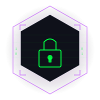

<div align="center">
  
  <h1>UMBRA</h1>
  <p><strong>Universal Cryptography Decoder — All algorithms. One tool. Zero servers.</strong></p>

  
  
  
  
</div>

---

## What is Umbra?

**Umbra** is a fully client-side cryptography workbench that lets you decode, encode, encrypt, decrypt and hash text using 30+ algorithms — all without sending a single byte to any server.

Think of it as a Swiss Army knife for crypto work: CTF challenges, security research, learning, debugging — Umbra handles it all from a single browser tab.

---

## ✨ Features

- **30+ algorithms** across 4 categories: Classic Ciphers, Encoding Schemes, Modern Encryption, and Hash Functions
- **Auto-Detect engine** — paste unknown ciphertext and Umbra identifies the format with a confidence score
- **Multi-tab workspace** — open multiple algorithms side-by-side like a real IDE
- **Brute Force mode** — for Caesar cipher, runs all 26 shifts at once
- **Operation History** — quick access to recent operations
- **Entropy analysis** — statistical info about your input (Shannon entropy, unique char count, etc.)
- **Dark/Light mode** — full theme toggle with hacker aesthetic
- **100% offline ready** — no CDN, no fonts, no external requests
- **Keyboard shortcuts** for power users
- **Open architecture** — easily extend with new algorithms (see Contributing)

---

## 🔐 Supported Algorithms

### Classic Ciphers
| Algorithm | Encrypt | Decrypt | Key Required |
|---|:---:|:---:|:---:|
| Caesar Cipher | ✅ | ✅ + Brute Force | Number (shift) |
| ROT13 | ✅ | ✅ | None |
| ROT47 | ✅ | ✅ | None |
| Atbash Cipher | ✅ | ✅ | None |
| Vigenère Cipher | ✅ | ✅ | Keyword |
| Beaufort Cipher | ✅ | ✅ | Keyword |
| Playfair Cipher | ✅ | ✅ | Keyword |
| Affine Cipher | ✅ | ✅ | a, b values |
| Rail Fence Cipher | ✅ | ✅ | Rail count |
| Columnar Transposition | ✅ | ✅ | Keyword |
| Simple Substitution | ✅ | ✅ | 26-char alphabet |

### Encoding Schemes
| Algorithm | Encode | Decode |
|---|:---:|:---:|
| Base64 | ✅ | ✅ |
| Base64 URL-safe | ✅ | ✅ |
| Base32 | ✅ | ✅ |
| Base58 (Bitcoin) | ✅ | ✅ |
| Hexadecimal | ✅ | ✅ |
| Binary (ASCII) | ✅ | ✅ |
| Octal | ✅ | ✅ |
| URL Encoding | ✅ | ✅ |
| HTML Entities | ✅ | ✅ |
| Unicode Escape | ✅ | ✅ |
| Morse Code | ✅ | ✅ |
| NATO Phonetic | ✅ | ✅ |

### Modern / Symmetric
| Algorithm | Encrypt | Decrypt | Note |
|---|:---:|:---:|:---|
| XOR Cipher | ✅ | ✅ | Key-repeating, hex output |
| AES-256-GCM | ✅ | ✅ | PBKDF2 key derivation |
| AES-256-CBC | ✅ | ✅ | PBKDF2 key derivation |

### Hash Functions
| Algorithm | Output Length | Note |
|---|:---:|:---|
| MD5 | 128-bit (32 hex) | Legacy, broken |
| SHA-1 | 160-bit (40 hex) | Deprecated |
| SHA-256 | 256-bit (64 hex) | Standard |
| SHA-384 | 384-bit (96 hex) | SHA-2 family |
| SHA-512 | 512-bit (128 hex) | SHA-2 family |
| CRC-32 | 32-bit (8 hex) | Checksum |

---

## 🚀 Getting Started

### Option 1 — Open Directly
Download the repo and open `index.html` in any modern browser. No build step required.

```bash
git clone https://github.com/youruser/umbra.git
cd umbra
# Open index.html in browser
```

### Option 2 — Serve Locally
```bash
# Python
python3 -m http.server 8080

# Node.js (npx)
npx serve .
```

Then open `http://localhost:8080`.

### Option 3 — Deploy to Static Host
Umbra is a pure static site. Deploy to GitHub Pages, Netlify, Vercel, or any static host — just drop the files.

---

## ⌨️ Keyboard Shortcuts

| Shortcut | Action |
|---|---|
| `Ctrl+K` | Focus algorithm search |
| `Ctrl+T` | Open Auto-Detect tab |
| `Ctrl+W` | Close active tab |
| `Ctrl+Enter` | Run current algorithm |
| `Esc` | Close sidebar (mobile) |

---

## 🗂️ Project Structure

```
umbra/
├── index.html          # Main entry point
├── assets/
│   └── logo.svg        # Umbra logo
├── css/
│   └── style.css       # Full stylesheet with dark/light theme
├── js/
│   ├── crypto.js       # All cryptography implementations
│   └── ui.js           # UI controller, tabs, history, auto-detect
└── README.md
```

---

## 🧩 Adding New Algorithms

Umbra is designed to be extensible. To add a new algorithm:

1. Open `js/crypto.js`
2. Create your algorithm object:

```javascript
const MyAlgo = {
  info: {
    name: 'My Algorithm',
    category: 'classic',       // classic | encoding | modern | hash
    description: 'Description of what this does.',
    keyRequired: true,
    keyType: 'text',           // text | number | password
    keyLabel: 'Key',
    keyHint: 'Hint for the user',
    async: false,              // set true if encode/decode return Promises
  },

  encode(text, key) {
    // your encryption logic
    return encryptedText;
  },

  decode(text, key) {
    // your decryption logic
    return decryptedText;
  },
};
```

3. Register it in the `window.ALGOS` map:

```javascript
window.ALGOS = {
  // ...existing entries...
  'my-algo': MyAlgo,
};
```

4. Add it to `SIDEBAR_GROUPS` in `js/ui.js`:

```javascript
{ id: 'my-algo', icon: '🔐' }
```

That's it — no build step, no config, no wiring.

---

## 🔒 Privacy & Security

- **No server-side processing.** Every operation runs in your browser.
- **No analytics, no telemetry, no cookies.**
- **No CDN calls** — all code is self-contained.
- AES operations use the browser's native **Web Crypto API** — the same engine used by HTTPS.
- Umbra is safe to use with sensitive data on air-gapped machines.

---

## 🛣️ Roadmap

Planned features for future versions:

- [ ] RSA encrypt/decrypt (with key pair generator)
- [ ] JWT decoder and verifier
- [ ] HMAC-SHA256 / HMAC-SHA512
- [ ] bcrypt hash display (read-only, uses external lib)
- [ ] File upload support (encode/hash files)
- [ ] Custom alphabet substitution builder
- [ ] Frequency analysis tool (for classical cipher cracking)
- [ ] Export results as JSON / TXT
- [ ] Plugin/extension API for third-party algorithms
- [ ] Multi-step pipeline: chain multiple operations
- [ ] PWA / installable offline app

---

## 🤝 Contributing

Contributions, bug reports and feature requests are welcome.

1. Fork the repository
2. Create a feature branch: `git checkout -b feature/my-algo`
3. Add your algorithm following the guide above
4. Ensure no external dependencies are added
5. Open a Pull Request

---

## 📜 License

MIT License — free to use, modify and distribute.

---

<div align="center">
  <sub>Built with ☕ and too much crypto knowledge. No data leaves your browser — ever.</sub>
</div>
